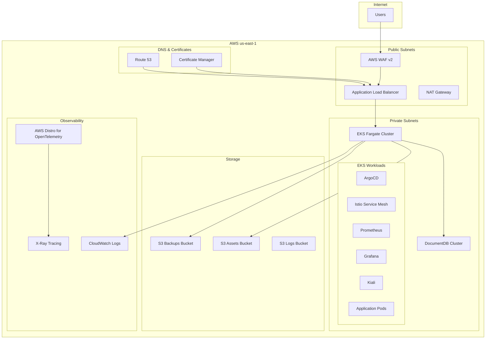

# Design Document: Tadeumendonca.io AWS Landing Zone

## Overview

This design document outlines the architecture for a production-ready AWS Landing Zone that supports a one-man startup's growth from initial deployment to enterprise scale. The solution implements a phased approach: Phase 1 provides a cost-effective single-account foundation ($515/month), while Phase 2 adds enterprise governance capabilities (+$95/month) when business needs justify the investment.

The architecture leverages AWS Fargate for serverless container compute, Amazon DocumentDB for modern document storage, and comprehensive observability through Prometheus, Grafana, and AWS Distro for OpenTelemetry. All resources are deployed in us-east-1 for optimal cost and service availability.

## Architecture

### High-Level Architecture



### Network Architecture

The network design implements a secure three-tier architecture with proper isolation:

- **Public Subnets**: Host ALB, WAF, and NAT Gateway for internet-facing services
- **Private Subnets**: Host EKS Fargate pods and DocumentDB for secure application execution
- **Multi-AZ Design**: Spans 2 availability zones for high availability
- **Security Groups**: Implement least-privilege access between tiers

### Compute Architecture

The compute layer uses AWS Fargate exclusively for serverless container execution:

- **Production Environment**: 2 vCPU, 4GB RAM (24/7 availability)
- **Staging Environment**: 1 vCPU, 2GB RAM (8 hours/day development usage)
- **Auto-scaling**: Automatic pod scaling based on demand
- **Zero Infrastructure Management**: No EC2 instances to patch or manage

## Components and Interfaces

### Core Infrastructure Components

#### 1. Network Infrastructure
- **VPC**: Custom VPC with CIDR 10.0.0.0/16
- **Public Subnets**: 10.0.1.0/24, 10.0.2.0/24 (2 AZs)
- **Private Subnets**: 10.0.10.0/24, 10.0.20.0/24 (2 AZs)
- **Database Subnets**: 10.0.100.0/24, 10.0.200.0/24 (2 AZs)
- **NAT Gateway**: Single NAT for cost optimization (production), can scale to multi-AZ
- **Internet Gateway**: For public subnet internet access

#### 2. Security Layer
- **AWS WAF v2**: OWASP Top 10 protection, rate limiting, bot control
- **Security Groups**: 
  - ALB Security Group: HTTP/HTTPS from internet
  - EKS Security Group: Traffic from ALB only
  - DocumentDB Security Group: Traffic from EKS only
- **IAM Roles**: Least-privilege access for all services
- **Encryption**: TLS 1.2+ in transit, AES-256 at rest

#### 3. Compute Platform
- **EKS Clusters**: Separate clusters for production and staging
- **Fargate Profiles**: Serverless compute for all pods
- **Node Selectors**: Automatic pod placement on Fargate
- **Resource Limits**: CPU and memory limits per environment

#### 4. Database Layer
- **DocumentDB Clusters**:
  - Production: Multi-AZ with 2 instances (t3.medium)
  - Staging: Single-AZ with 1 instance (t3.medium)
- **Backup Strategy**: Automated daily backups with 7-day retention
- **Security**: VPC isolation, encryption at rest and in transit
- **Connection Pooling**: Efficient resource utilization

### Application Platform Components

#### 1. Service Mesh (Istio)
- **Control Plane**: Istiod for service mesh management
- **Data Plane**: Envoy sidecars for all application pods
- **Security**: mTLS for service-to-service communication
- **Traffic Management**: Load balancing, circuit breaking, retries
- **Observability**: Metrics, logs, and traces collection

#### 2. GitOps Platform (ArgoCD)
- **Application Controller**: Monitors Git repositories for changes
- **Sync Engine**: Applies Kubernetes manifests automatically
- **Rollout Controller**: Argo Rollouts for advanced deployment strategies
- **UI Dashboard**: Web interface for deployment monitoring
- **RBAC**: Role-based access control for team collaboration

#### 3. Observability Stack
- **Prometheus**: Metrics collection and storage
- **Grafana**: Visualization dashboards and alerting
- **Kiali**: Service mesh topology and traffic visualization
- **AWS Distro for OpenTelemetry**: Distributed tracing with X-Ray integration
- **CloudWatch**: Log aggregation and AWS service metrics

### Storage Components

#### 1. S3 Buckets
- **Assets Bucket**: Application static assets with CloudFront integration
- **Backups Bucket**: Database and application backups with lifecycle policies
- **Logs Bucket**: Application and infrastructure logs with retention policies
- **Intelligent Tiering**: Automatic cost optimization for infrequently accessed data

#### 2. DocumentDB Storage
- **Cluster Storage**: Auto-scaling from 10GB to 64TB
- **Backup Storage**: Automated backups with point-in-time recovery
- **Encryption**: AWS KMS managed keys for data at rest

## Data Models

### Infrastructure Data Models

#### 1. Network Configuration
```yaml
vpc_config:
  cidr_block: "10.0.0.0/16"
  availability_zones: ["us-east-1a", "us-east-1b"]
  public_subnets: ["10.0.1.0/24", "10.0.2.0/24"]
  private_subnets: ["10.0.10.0/24", "10.0.20.0/24"]
  database_subnets: ["10.0.100.0/24", "10.0.200.0/24"]
  enable_nat_gateway: true
  single_nat_gateway: true  # Cost optimization
```

#### 2. EKS Cluster Configuration
```yaml
eks_config:
  cluster_version: "1.28"
  compute_type: "fargate"
  fargate_profiles:
    - name: "default"
      subnets: ["private"]
      selectors:
        - namespace: "default"
        - namespace: "kube-system"
        - namespace: "istio-system"
        - namespace: "argocd"
        - namespace: "monitoring"
```

#### 3. DocumentDB Configuration
```yaml
documentdb_config:
  engine_version: "4.0.0"
  instance_class: "db.t3.medium"
  cluster_size:
    production: 2  # Multi-AZ
    staging: 1     # Single-AZ
  backup_retention_period: 7
  preferred_backup_window: "03:00-04:00"
  preferred_maintenance_window: "sun:04:00-sun:05:00"
```

### Application Data Models

#### 1. Service Mesh Configuration
```yaml
istio_config:
  version: "1.19"
  components:
    - istiod
    - istio-proxy
  features:
    - automatic_sidecar_injection: true
    - mtls_mode: "STRICT"
    - telemetry_v2: true
  gateways:
    - name: "main-gateway"
      hosts: ["*.tadeumendonca.io"]
      tls_mode: "SIMPLE"
```

#### 2. GitOps Configuration
```yaml
argocd_config:
  version: "2.8"
  repositories:
    - url: "https://github.com/tadeumendonca/infrastructure"
      type: "git"
    - url: "https://github.com/tadeumendonca/applications"
      type: "git"
  applications:
    - name: "infrastructure"
      source: "infrastructure/"
      destination: "default"
      sync_policy: "automated"
```

#### 3. Observability Configuration
```yaml
observability_config:
  prometheus:
    retention: "30d"
    storage_size: "50Gi"
    scrape_interval: "15s"
  grafana:
    admin_password: "generated"
    datasources: ["prometheus", "cloudwatch", "x-ray"]
  adot:
    traces_endpoint: "x-ray"
    metrics_endpoint: "prometheus"
    logs_endpoint: "cloudwatch"
```

## Correctness Properties

*A property is a characteristic or behavior that should hold true across all valid executions of a system—essentially, a formal statement about what the system should do. Properties serve as the bridge between human-readable specifications and machine-verifiable correctness guarantees.*

### Property 1: Network Isolation
*For any* network traffic between tiers, the system should only allow connections that match the defined security group rules and deny all other traffic.
**Validates: Requirements 2.2, 2.3, 2.8**

### Property 2: Fargate Resource Allocation
*For any* pod deployment request, the EKS cluster should allocate the exact CPU and memory resources specified and reject requests that exceed Fargate limits.
**Validates: Requirements 3.1, 3.3, 3.8**

### Property 3: Auto-scaling Behavior
*For any* increase in application load, the Container Service should scale pods up within 60 seconds, and for any decrease in load, should scale pods down within 300 seconds.
**Validates: Requirements 3.3, 3.4**

### Property 4: Database Failover
*For any* DocumentDB primary instance failure, the system should automatically promote a replica to primary within 30 seconds and maintain data consistency.
**Validates: Requirements 5.5, 5.7**

### Property 5: Service Mesh mTLS
*For any* service-to-service communication within the mesh, all traffic should be encrypted with mTLS and connections without valid certificates should be rejected.
**Validates: Requirements 6.2, 6.3**

### Property 6: GitOps Synchronization
*For any* Git repository change, ArgoCD should detect the change within 3 minutes and apply the updates to the cluster with proper validation.
**Validates: Requirements 7.2, 7.9**

### Property 7: Deployment Rollback
*For any* failed deployment, the GitOps system should be able to rollback to the previous working state within 5 minutes using Git history.
**Validates: Requirements 7.3, 7.12**

### Property 8: Observability Data Collection
*For any* application pod, the observability stack should collect metrics, logs, and traces without impacting application performance by more than 5%.
**Validates: Requirements 8.1, 8.4, 8.5**

### Property 9: WAF Protection
*For any* HTTP request matching OWASP Top 10 attack patterns, the WAF should block the request and log the incident for security monitoring.
**Validates: Requirements 2.6, 2.7, 8.10**

### Property 10: Certificate Management
*For any* SSL certificate approaching expiration (30 days), the Certificate Service should automatically renew the certificate without service interruption.
**Validates: Requirements 9.4**

### Property 11: Storage Lifecycle
*For any* object stored in S3 buckets, the intelligent tiering should automatically move infrequently accessed data to cheaper storage classes within the defined timeframes.
**Validates: Requirements 10.3, 10.4**

### Property 12: Resource Tagging
*For any* AWS resource created by the infrastructure, it should have all required tags (Environment, Owner, Project) for cost tracking and compliance.
**Validates: Requirements 1.4, 11.7**

## Error Handling

### Infrastructure Error Handling

#### 1. Network Failures
- **NAT Gateway Failure**: Automatic failover to secondary NAT Gateway (when configured)
- **Subnet Unavailability**: Automatic pod rescheduling to available subnets
- **Security Group Misconfigurations**: Terraform validation prevents invalid rules

#### 2. Compute Failures
- **Fargate Task Failures**: Automatic restart with exponential backoff
- **EKS Control Plane Issues**: AWS managed service handles recovery automatically
- **Resource Exhaustion**: Cluster autoscaler requests additional Fargate capacity

#### 3. Database Failures
- **Primary Instance Failure**: Automatic failover to replica within 30 seconds
- **Backup Failures**: CloudWatch alarms notify operations team
- **Connection Pool Exhaustion**: Circuit breaker pattern prevents cascade failures

### Application Error Handling

#### 1. Service Mesh Failures
- **Sidecar Proxy Failures**: Automatic restart and traffic rerouting
- **Certificate Expiration**: Automatic certificate rotation every 24 hours
- **Circuit Breaker Activation**: Fallback responses for downstream failures

#### 2. GitOps Failures
- **Sync Failures**: Automatic retry with exponential backoff
- **Manifest Validation Errors**: Deployment blocked until issues resolved
- **Git Repository Unavailability**: Local cache maintains last known good state

#### 3. Observability Failures
- **Metrics Collection Failures**: Graceful degradation without impacting applications
- **Dashboard Unavailability**: Multiple Grafana replicas for high availability
- **Trace Collection Issues**: Sampling rate adjustment to reduce load

### Recovery Procedures

#### 1. Disaster Recovery
- **RTO (Recovery Time Objective)**: 4 hours for full environment restoration
- **RPO (Recovery Point Objective)**: 1 hour maximum data loss
- **Backup Strategy**: Daily automated backups with cross-region replication
- **Infrastructure as Code**: Complete environment recreation from Terraform

#### 2. Monitoring and Alerting
- **Health Checks**: Comprehensive monitoring of all critical components
- **Alert Escalation**: Automated notifications for critical failures
- **Runbook Integration**: Automated remediation for common issues

## Testing Strategy

### Dual Testing Approach

The testing strategy implements both unit testing and property-based testing to ensure comprehensive coverage and correctness validation.

#### Unit Testing
Unit tests verify specific examples, edge cases, and error conditions:
- **Infrastructure Tests**: Terraform plan validation and resource configuration
- **Application Tests**: Kubernetes manifest validation and deployment verification
- **Integration Tests**: End-to-end workflow validation
- **Security Tests**: Penetration testing and vulnerability scanning

#### Property-Based Testing
Property tests verify universal properties across all inputs with minimum 100 iterations per test:
- **Network Property Tests**: Security group rule validation across all traffic patterns
- **Scaling Property Tests**: Auto-scaling behavior under various load conditions
- **Failover Property Tests**: Database and service failover scenarios
- **Security Property Tests**: WAF protection against various attack vectors

### Testing Configuration

Each property-based test will:
- Run minimum 100 iterations with randomized inputs
- Reference the corresponding design document property
- Use tag format: **Feature: tadeumendonca-io-aws-landing-zone, Property {number}: {property_text}**
- Integrate with CI/CD pipeline for continuous validation

### Test Environment Strategy

- **Staging Environment**: Full replica of production for integration testing
- **Development Environment**: Lightweight version for rapid iteration
- **Property Test Environment**: Dedicated environment for property-based test execution
- **Chaos Engineering**: Regular failure injection to validate resilience properties

---

*This design provides a comprehensive foundation for implementing a production-ready AWS Landing Zone that balances cost, operational simplicity, and enterprise-grade capabilities.*