# Design Document: Tadeumendonca.io AWS Landing Zone

## Overview

This design document outlines a comprehensive, scalable AWS foundation and web application hosting infrastructure for a one-man digital startup that can grow into an enterprise. The solution starts with a secure organizational foundation using AWS Organizations and Single Sign-On (SSO), then layers on a modern Kubernetes platform with service mesh capabilities, GitOps deployment workflows, and comprehensive observability.

The architecture follows a foundation-first approach with AWS Organizations for multi-account management, AWS SSO for centralized identity, followed by cloud-native best practices with Infrastructure as Code (Terraform using official AWS community modules), containerized workloads (EKS), service mesh (Istio), GitOps (ArgoCD), and a complete observability stack (Prometheus, Grafana, Kiali). This design enables secure scaling from startup to enterprise while maintaining security, reliability, and cost optimization.

**Foundation Strategy:** The infrastructure starts with AWS Organizations to establish a secure, scalable multi-account foundation that can grow with the business, ensuring proper separation of concerns and centralized governance from day one.

**Module Strategy:** The infrastructure leverages proven, community-maintained Terraform modules from the terraform-aws-modules organization to ensure best practices, reduce maintenance overhead, and benefit from community contributions and security updates.

## Architecture

### High-Level Multi-Account Architecture

```mermaid
graph TB
    subgraph "AWS Organizations"
        subgraph "Management Account"
            ORG[AWS Organizations]
            SSO[AWS SSO/Identity Center]
            CT[CloudTrail Organization Trail]
            BILL[Consolidated Billing]
        end
        
        subgraph "AFT Management Account"
            AFT[Account Factory for Terraform]
            AFTPIPE[AFT Pipeline]
            AFTREPO[Account Request Repository]
            AFTCUST[Account Customization Repository]
        end
        
        subgraph "Security OU"
            SEC[Security Account]
            LOG[Log Archive Account]
            AUDIT[Audit Account]
        end
        
        subgraph "Development OU"
            DEV[Development Account]
        end
        
        subgraph "Staging OU"
            STAGE[Staging Account]
        end
        
        subgraph "Production OU"
            PROD[Production Account]
        end
    end
    
    subgraph "Production Account Infrastructure"
        subgraph "Global Services (us-east-1)"
            CF[CloudFront CDN]
            ACM[ACM Certificates]
            R53[Route 53 DNS]
        end
        
        subgraph "Primary Region (sa-east-1)"
            subgraph "VPC"
                subgraph "Public Subnets"
                    ALB[Application Load Balancer]
                    NAT[NAT Gateway]
                end
                
                subgraph "Private Subnets"
                    subgraph "EKS Cluster"
                        subgraph "Control Plane"
                            API[EKS API Server]
                        end
                        
                        subgraph "Worker Nodes"
                            subgraph "Istio System"
                                IG[Istio Gateway]
                                IC[Istio Control Plane]
                            end
                            
                            subgraph "Application Pods"
                                APP1[App 1 + Sidecar]
                                APP2[App 2 + Sidecar]
                            end
                            
                            subgraph "GitOps"
                                ARGO[ArgoCD]
                                ROLLOUTS[Argo Rollouts]
                            end
                            
                            subgraph "Observability"
                                PROM[Prometheus]
                                GRAF[Grafana]
                                KIALI[Kiali]
                            end
                        end
                    end
                    
                    RDS[(RDS PostgreSQL)]
                end
            end
            
            S3[S3 Buckets]
        end
    end
    
    USER[Users] --> SSO
    SSO --> DEV
    SSO --> STAGE
    SSO --> PROD
    
    AFT --> DEV
    AFT --> STAGE
    AFT --> PROD
    AFT --> SEC
    AFT --> LOG
    AFT --> AUDIT
    
    AFTREPO --> AFTPIPE
    AFTCUST --> AFTPIPE
    
    USER --> CF
    CF --> ALB
    ALB --> IG
    IG --> APP1
    IG --> APP2
    APP1 --> RDS
    APP2 --> RDS
    
    ARGO --> APP1
    ARGO --> APP2
    ROLLOUTS --> APP1
    ROLLOUTS --> APP2
    
    PROM --> APP1
    PROM --> APP2
    GRAF --> PROM
    KIALI --> IC
```



### Account Strategy

**Management Account:**
- AWS Organizations management
- AWS SSO (Identity Center) for centralized authentication
- Organization-wide CloudTrail for audit logging
- Consolidated billing and cost management
- Service Control Policies (SCPs) enforcement

**AFT Management Account:**
- AWS Account Factory for Terraform (AFT) infrastructure
- Automated account provisioning and lifecycle management
- Account baseline configuration and customization
- Integration with AWS Control Tower for enhanced governance
- Git-based account-as-code workflows

**Security Organizational Unit:**
- **Security Account**: Security tooling and compliance monitoring
- **Log Archive Account**: Centralized log storage and retention
- **Audit Account**: Independent security auditing and compliance

**Environment Organizational Units:**
- **Development Account**: Development workloads and testing
- **Staging Account**: Pre-production testing and validation
- **Production Account**: Live production workloads and data

## Components and Interfaces

### 1. AWS Organizations Foundation

**Organizations Structure:**
- **Root Organization**: Top-level container for all accounts
- **Management Account**: Central control and billing account
- **Organizational Units (OUs)**: Logical groupings for accounts
  - Security OU: Security, logging, and audit accounts
  - Development OU: Development and testing accounts
  - Staging OU: Pre-production accounts
  - Production OU: Live production accounts

**Service Control Policies (SCPs):**
- **Root SCP**: Baseline security controls for all accounts
- **Development SCP**: Relaxed policies for development work
- **Production SCP**: Strict security controls for production
- **Security SCP**: Enhanced controls for security accounts

**Account Creation Automation:**
- Terraform modules for automated account provisioning
- Standardized account baseline configuration
- Automatic OU assignment based on account purpose
- Integration with AWS SSO for immediate access setup

### 2. AWS Account Factory for Terraform (AFT)

**AFT Architecture:**
- **AFT Management Account**: Dedicated account for AFT infrastructure
- **AFT Pipeline**: Automated account provisioning and customization pipeline
- **Account Request Repository**: Git repository for account requests and configurations
- **Account Customization Repository**: Git repository for account-specific customizations
- **AFT Backend**: Terraform state management and execution environment

**Account Provisioning Workflow:**
- **Account Request**: Submit account request via Git repository
- **Validation**: Automated validation of account configuration
- **Provisioning**: AFT creates account and applies baseline configuration
- **Customization**: Apply account-specific customizations and configurations
- **Enrollment**: Enroll account in AWS Control Tower (if enabled)
- **Notification**: Notify stakeholders of account creation completion

**Account Baseline Configuration:**
- **Security Baseline**: Standard security configurations and policies
- **Compliance Baseline**: Regulatory and organizational compliance settings
- **Networking Baseline**: Standard VPC and networking configurations
- **Monitoring Baseline**: CloudTrail, Config, and monitoring setup
- **Tagging Baseline**: Standardized resource tagging policies

**Integration Points:**
- **AWS Control Tower**: Enhanced governance and guardrails
- **AWS Organizations**: Account organization and policy management
- **AWS SSO**: Automated permission set assignment
- **Terraform Cloud/Enterprise**: State management and execution
- **Git Repositories**: Version-controlled account configurations

### 3. AWS SSO (Identity Center) Configuration

**Permission Sets:**
- **OrganizationAdmin**: Full access to management account and organization
- **ProductionAdmin**: Administrative access to production accounts
- **DeveloperAccess**: Development and staging account access
- **ReadOnlyAccess**: Read-only access across all accounts
- **SecurityAuditor**: Security-focused access for compliance

**Identity Source Integration:**
- Internal identity store for startup phase
- External identity provider integration (Google Workspace, Azure AD)
- Multi-factor authentication (MFA) enforcement
- Session duration and re-authentication policies

**Access Management:**
- Cross-account role assumption through permission sets
- Temporary elevated access for emergency situations
- Automated access reviews and compliance reporting
- Integration with AWS CloudTrail for access auditing

### 4. Network Infrastructure

**VPC Configuration (using terraform-aws-modules/vpc/aws):**
- CIDR: 10.0.0.0/16
- Public subnets: 10.0.1.0/24, 10.0.2.0/24 (across 2 AZs)
- Private subnets: 10.0.10.0/24, 10.0.20.0/24 (across 2 AZs)
- Database subnets: 10.0.100.0/24, 10.0.200.0/24 (across 2 AZs)

**Module Benefits:**
- Proven subnet calculations and CIDR management
- Automatic NAT Gateway and Internet Gateway configuration
- Built-in database subnet group creation
- Comprehensive tagging and naming conventions

**Security Groups:**
- EKS Control Plane SG: Allows API access from worker nodes
- EKS Worker Node SG: Allows cluster communication and ALB traffic
- RDS SG: Allows PostgreSQL access only from EKS worker nodes
- ALB SG: Allows HTTP/HTTPS from internet

**Routing:**
- Public subnets route to Internet Gateway
- Private subnets route to NAT Gateway for outbound access (one per AZ for HA)
- Database subnets isolated with no internet access

### 5. EKS Cluster Configuration

**Cluster Specifications:**
- Kubernetes version: 1.28+
- Managed node groups with auto-scaling
- Instance types: t3.medium (cost-optimized for startup)
- Min nodes: 2, Max nodes: 10
- Spot instances enabled for cost optimization

**Add-ons:**
- AWS Load Balancer Controller for ALB integration
- EBS CSI Driver for persistent storage
- CoreDNS for cluster DNS
- kube-proxy for network proxy

**RBAC Configuration:**
- Cluster admin access via IAM roles
- Service accounts with IRSA (IAM Roles for Service Accounts)
- Namespace-based access controls

### 6. Istio Service Mesh

**Installation Method:**
- Helm-based installation for better lifecycle management
- Istio Operator for configuration management
- Ambient mesh profile for reduced resource overhead

**Components:**
- **Istiod**: Control plane for configuration and certificate management
- **Istio Gateway**: Ingress gateway for external traffic
- **Envoy Sidecars**: Automatic injection for application pods
- **Istio Proxy**: Service mesh data plane

**Configuration:**
- mTLS enabled by default for all service-to-service communication
- Traffic policies for load balancing and circuit breaking
- Security policies for authentication and authorization
- Telemetry configuration for metrics and tracing

### 7. GitOps with ArgoCD and Argo Rollouts

**ArgoCD Configuration:**
- Deployed in dedicated `argocd` namespace
- Git repository integration for application manifests
- Multi-environment support (dev/prod)
- RBAC integration with Kubernetes

**Argo Rollouts Configuration:**
- Custom resource definitions for advanced deployment strategies
- Integration with Istio for traffic splitting
- Prometheus integration for automated analysis
- Notification webhooks for deployment events

**Deployment Strategies:**
- **Canary Deployments**: Gradual traffic shifting (10% → 50% → 100%)
- **Blue-Green Deployments**: Instant traffic switching with rollback capability
- **Analysis Templates**: Automated success/failure determination based on metrics

### 8. Observability Stack

**Prometheus Configuration:**
- Deployed via Helm chart (kube-prometheus-stack)
- Service discovery for Kubernetes and Istio metrics
- Custom metrics from application pods
- Alert rules for infrastructure and application health
- 30-day retention for metrics

**Grafana Configuration:**
- Pre-configured dashboards for Kubernetes and Istio
- Custom dashboards for application metrics
- Alert notification channels (email, Slack)
- User authentication and authorization

**Kiali Configuration:**
- Service mesh topology visualization
- Traffic flow analysis and health monitoring
- Configuration validation for Istio resources
- Integration with Prometheus for metrics display

### 9. Database Services

**RDS PostgreSQL Configuration:**
- Engine version: PostgreSQL 15+
- Instance class: db.t3.micro (cost-optimized)
- Multi-AZ deployment for high availability
- Automated backups with 7-day retention
- Encryption at rest with AWS managed keys

**Connection Management:**
- Connection pooling via PgBouncer sidecar
- Database credentials stored in AWS Secrets Manager
- Network isolation in private subnets

### 10. Content Delivery and Storage

**CloudFront Configuration:**
- Global edge locations for content delivery
- Origin: S3 buckets and ALB
- SSL/TLS termination with ACM certificates
- Caching policies optimized for web applications
- Compression enabled for bandwidth optimization

**S3 Configuration (using terraform-aws-modules/s3-bucket/aws):**
- **Assets Bucket**: Static assets with intelligent tiering
- **Backups Bucket**: Application backups with lifecycle policies
- Versioning enabled for data protection
- Server-side encryption with AWS managed keys
- Intelligent tiering for automatic cost optimization
- Lifecycle rules for backup retention (30d → IA, 90d → Glacier, 365d → Delete)

**Module Benefits:**
- Comprehensive security configurations (block public access)
- Built-in encryption and versioning management
- Lifecycle policy templates for cost optimization
- Consistent naming and tagging

### 11. Load Balancing

**Application Load Balancer:**
- Internet-facing ALB in public subnets
- SSL termination with ACM certificates
- Health checks for target groups
- Integration with AWS Load Balancer Controller
- Request routing based on host headers and paths

**Istio Gateway Integration:**
- ALB forwards traffic to Istio Gateway service
- Istio handles internal routing and load balancing
- Support for multiple applications via virtual services

## Data Models

### AWS Organizations Configuration

**Organization Structure:**
```yaml
# AWS Organizations Terraform Configuration
resource "aws_organizations_organization" "main" {
  aws_service_access_principals = [
    "sso.amazonaws.com",
    "cloudtrail.amazonaws.com",
    "config.amazonaws.com"
  ]
  
  feature_set = "ALL"
  
  enabled_policy_types = [
    "SERVICE_CONTROL_POLICY",
    "TAG_POLICY"
  ]
}

# Organizational Units
resource "aws_organizations_organizational_unit" "security" {
  name      = "Security"
  parent_id = aws_organizations_organization.main.roots[0].id
}

resource "aws_organizations_organizational_unit" "development" {
  name      = "Development"
  parent_id = aws_organizations_organization.main.roots[0].id
}
```

**Service Control Policy Example:**
```json
{
  "Version": "2012-10-17",
  "Statement": [
    {
      "Effect": "Deny",
      "Action": [
        "organizations:LeaveOrganization",
        "account:CloseAccount"
      ],
      "Resource": "*"
    },
    {
      "Effect": "Deny",
      "Action": "ec2:TerminateInstances",
      "Resource": "*",
      "Condition": {
        "StringNotEquals": {
          "aws:PrincipalTag/Environment": "Development"
        }
      }
    }
  ]
}
```

**AWS SSO Permission Set:**
```yaml
# Permission Set for Developers
resource "aws_ssoadmin_permission_set" "developer" {
  name             = "DeveloperAccess"
  description      = "Developer access to development and staging accounts"
  instance_arn     = data.aws_ssoadmin_instances.main.arns[0]
  session_duration = "PT8H"
  
  tags = {
    Environment = "Multi-Account"
    Purpose     = "Developer-Access"
  }
}
```

**AWS Account Factory for Terraform (AFT):**
```yaml
# AFT Configuration
module "aft" {
  source = "github.com/aws-ia/terraform-aws-account-factory-for-terraform"
  
  # AFT Management Account Configuration
  ct_management_account_id    = var.ct_management_account_id
  log_archive_account_id      = var.log_archive_account_id
  audit_account_id           = var.audit_account_id
  aft_management_account_id  = var.aft_management_account_id
  
  # Repository Configuration
  account_request_repo_name = "aft-account-requests"
  global_customizations_repo_name = "aft-global-customizations"
  account_customizations_repo_name = "aft-account-customizations"
  
  # AFT Feature Configuration
  aft_feature_set                = "ALL"
  aft_feature_cloudtrail_data_events = true
  aft_feature_enterprise_support     = false
  aft_feature_delete_default_vpcs_enabled = true
  
  # Terraform Configuration
  terraform_version = "1.5.0"
  terraform_distribution = "oss"
}
```

**Account Request Example:**
```yaml
# account-requests/production-account.tf
module "production_account" {
  source = "./modules/aft-account-request"

  control_tower_parameters = {
    AccountEmail              = "production@tadeumendonca.io"
    AccountName               = "Production"
    ManagedOrganizationalUnit = "Production"
    SSOUserEmail             = "admin@tadeumendonca.io"
    SSOUserFirstName         = "Production"
    SSOUserLastName          = "Admin"
  }

  account_tags = {
    Environment = "Production"
    Owner       = "Platform Team"
    CostCenter  = "Engineering"
  }

  change_management_parameters = {
    change_requested_by = "Platform Team"
    change_reason       = "Production workload account"
  }

  custom_fields = {
    backup_retention = "7-years"
    compliance_level = "high"
  }

  account_customizations_name = "production-baseline"
}
```

### Infrastructure State Management

**Terraform State:**
- Remote state stored in Terraform Cloud
- State locking for concurrent operations
- Workspace separation for environments
- Sensitive values encrypted

**Kubernetes Resources:**
```yaml
# Application Deployment with Istio
apiVersion: argoproj.io/v1alpha1
kind: Rollout
metadata:
  name: web-app
spec:
  replicas: 3
  strategy:
    canary:
      steps:
      - setWeight: 10
      - pause: {duration: 30s}
      - setWeight: 50
      - pause: {duration: 30s}
      trafficRouting:
        istio:
          virtualService:
            name: web-app-vs
          destinationRule:
            name: web-app-dr
```

**Istio Configuration:**
```yaml
# Virtual Service for Traffic Management
apiVersion: networking.istio.io/v1beta1
kind: VirtualService
metadata:
  name: web-app-vs
spec:
  hosts:
  - web-app.example.com
  gateways:
  - istio-gateway
  http:
  - route:
    - destination:
        host: web-app
        subset: stable
      weight: 90
    - destination:
        host: web-app
        subset: canary
      weight: 10
```

### Monitoring Data Models

**Prometheus Metrics:**
- Infrastructure metrics: CPU, memory, network, disk
- Application metrics: Request rate, error rate, duration
- Istio metrics: Service mesh traffic and security
- Custom business metrics via application instrumentation

**Alert Definitions:**
```yaml
# High Error Rate Alert
- alert: HighErrorRate
  expr: rate(istio_requests_total{response_code!~"2.."}[5m]) > 0.1
  for: 5m
  labels:
    severity: warning
  annotations:
    summary: "High error rate detected"
```

## Correctness Properties

*A property is a characteristic or behavior that should hold true across all valid executions of a system-essentially, a formal statement about what the system should do. Properties serve as the bridge between human-readable specifications and machine-verifiable correctness guarantees.*

Now I need to analyze the acceptance criteria to determine which ones can be tested as properties:

### Converting EARS to Properties

Based on the prework analysis, I'll convert the testable acceptance criteria into universally quantified properties:

**Property 1: Traffic Routing and Load Distribution**
*For any* incoming traffic to the infrastructure, the system should route public traffic through public subnets and distribute application traffic evenly across healthy instances
**Validates: Requirements 1.4, 2.1**

**Property 2: Security Group Access Control**
*For any* network connection attempt between components, the system should allow only necessary traffic as defined by security group rules and deny all other traffic
**Validates: Requirements 1.6**

**Property 3: Load Balancer Failover**
*For any* application instance that becomes unhealthy, the load balancer should automatically exclude it from traffic distribution and route all traffic to remaining healthy instances
**Validates: Requirements 2.2**

**Property 4: Container Autoscaling**
*For any* change in application load (increase or decrease), the container service should automatically adjust the number of running pods to match demand while minimizing costs
**Validates: Requirements 3.2, 3.3, 8.6**

**Property 5: Zero-Downtime Deployments**
*For any* application version update, the container service should deploy the new version using rolling updates without causing service interruption
**Validates: Requirements 3.4**

**Property 6: Service Mesh Sidecar Injection**
*For any* application pod deployed in the mesh-enabled namespace, the service mesh should automatically inject a sidecar proxy
**Validates: Requirements 3.8**

**Property 7: End-to-End Encryption**
*For any* data transmission within the infrastructure, the system should encrypt all communication using TLS 1.2 or higher and mTLS for service-to-service communication
**Validates: Requirements 3.9, 7.2**

**Property 8: Database Access Control**
*For any* connection attempt to the database service, access should be allowed only from application containers and denied from all other sources
**Validates: Requirements 4.3**

**Property 9: CDN Caching and Delivery**
*For any* static asset request, the CDN service should cache the content at edge locations and deliver it with compression enabled
**Validates: Requirements 5.1, 5.5**

**Property 10: Cache Invalidation**
*For any* static content update, the CDN service should invalidate the cached version within 5 minutes
**Validates: Requirements 5.4**

**Property 11: Certificate Auto-Renewal**
*For any* SSL/TLS certificate approaching expiration, the certificate service should automatically renew it before expiration
**Validates: Requirements 6.4**

**Property 12: Storage Intelligent Tiering**
*For any* data stored in the storage service, the system should automatically move infrequently accessed data to cheaper storage classes based on access patterns
**Validates: Requirements 8.3**

**Property 13: Comprehensive Logging**
*For any* API call, access attempt, or load balancer request, the system should generate and store audit logs for security and debugging purposes
**Validates: Requirements 7.5, 9.5**

**Property 14: Metrics Collection and Alerting**
*For any* infrastructure or application component, the observability stack should collect metrics and send alerts when critical thresholds are exceeded
**Validates: Requirements 9.1, 9.7**

**Property 15: GitOps Synchronization**
*For any* change committed to the Git repository, the GitOps service should automatically detect and sync the changes to the target environment
**Validates: Requirements 10.2**

**Property 16: Progressive Delivery Strategies**
*For any* application deployment using canary or blue-green strategy, the GitOps service should manage traffic shifting and automatically rollback on failure based on success metrics
**Validates: Requirements 10.7, 10.8**

**Property 17: Manifest Validation**
*For any* Kubernetes manifest submitted for deployment, the GitOps service should validate the configuration before applying it to the cluster
**Validates: Requirements 10.9**

**Property 18: Deployment Event Notifications**
*For any* deployment event (success, failure, rollback), the GitOps service should send notifications to configured channels
**Validates: Requirements 10.11**

**Property 19: Health-Based Rollback**
*For any* deployment that fails health checks or violates success metrics, the GitOps service should automatically trigger a rollback to the previous stable version
**Validates: Requirements 10.12**

## Error Handling

### Infrastructure Failures

**EKS Cluster Failures:**
- Node failures handled by auto-scaling groups replacing unhealthy nodes
- Control plane failures managed by AWS with automatic failover
- Pod failures handled by Kubernetes with automatic restart and rescheduling

**Database Failures:**
- RDS Multi-AZ provides automatic failover to standby instance
- Connection failures handled by application retry logic with exponential backoff
- Backup and restore procedures for disaster recovery

**Network Failures:**
- Multiple availability zones provide redundancy for network failures
- NAT Gateway failures handled by deploying across multiple AZs
- Load balancer health checks remove unhealthy targets automatically

### Application Failures

**Deployment Failures:**
- Argo Rollouts provides automatic rollback on failed health checks
- Blue-green deployments allow instant rollback to previous version
- Canary deployments limit blast radius of failed deployments

**Service Mesh Failures:**
- Circuit breaker patterns prevent cascade failures
- Retry policies with exponential backoff for transient failures
- Timeout configurations prevent hanging requests

**Monitoring and Alerting:**
- Dead man's switch alerts for monitoring system failures
- Multi-channel alerting (email, Slack) for redundancy
- Escalation policies for critical alerts

### Security Incident Response

**Access Control Violations:**
- Immediate alert generation for unauthorized access attempts
- Automatic IP blocking for repeated violations
- Audit trail preservation for forensic analysis

**Certificate Expiration:**
- Automated renewal with 30-day advance warning
- Fallback procedures for manual certificate management
- Monitoring for certificate validation failures

## Testing Strategy

### Dual Testing Approach

The testing strategy employs both unit tests and property-based tests to ensure comprehensive coverage:

**Unit Tests:**
- Validate specific infrastructure configurations and integrations
- Test concrete examples of deployment scenarios
- Verify error conditions and edge cases
- Focus on integration points between AWS services

**Property-Based Tests:**
- Verify universal properties across all inputs using randomized testing
- Test system behavior under various load conditions
- Validate security and compliance requirements across all scenarios
- Ensure correctness properties hold for any valid configuration

### Property-Based Testing Configuration

**Testing Framework:** 
- **Terraform**: Use Terratest for infrastructure property testing
- **Kubernetes**: Use property-based testing with generated workloads and configurations
- **Minimum 100 iterations** per property test to ensure statistical confidence

**Test Execution:**
- Each property test references its corresponding design document property
- Tag format: **Feature: web-application-hosting, Property {number}: {property_text}**
- Automated execution in CI/CD pipeline before infrastructure changes

**Test Categories:**

1. **Infrastructure Properties:**
   - Network routing and security group validation
   - Auto-scaling behavior under load variations
   - High availability and failover scenarios

2. **Security Properties:**
   - Encryption validation for all data paths
   - Access control verification across all components
   - Certificate lifecycle management

3. **Deployment Properties:**
   - Zero-downtime deployment validation
   - Progressive delivery strategy verification
   - Rollback mechanism testing

4. **Observability Properties:**
   - Metrics collection completeness
   - Alert generation accuracy
   - Log aggregation and retention

### Integration Testing

**End-to-End Scenarios:**
- Complete application deployment lifecycle
- Multi-service communication through service mesh
- Disaster recovery and backup procedures
- Performance testing under realistic load conditions

**Chaos Engineering:**
- Random node termination to test resilience
- Network partition simulation
- Resource exhaustion scenarios
- Security breach simulation

The combination of unit tests and property-based tests provides comprehensive validation that the infrastructure meets all requirements while maintaining reliability and security under all conditions.