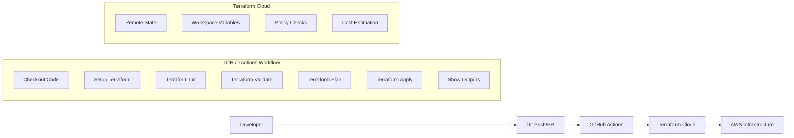

# CI/CD Pipeline Documentation

This document describes the Continuous Integration and Continuous Deployment (CI/CD) pipeline for the Tadeumendonca.io AWS Landing Zone project.

## Overview

The CI/CD pipeline is built using:
- **GitHub Actions** for workflow automation
- **Terraform Cloud** for remote state management and execution
- **AWS** as the target infrastructure platform

## Pipeline Architecture



## Workflow Triggers

The pipeline is triggered by:

### 1. Automatic Triggers
- **Push to main branch** - Triggers full plan and apply workflow
- **Pull Request to main** - Triggers plan-only workflow for validation
- **Changes to specific paths**:
  - `.github/**` (workflow changes)
  - `terraform/**` (infrastructure changes)
  - `src/**` (application changes)

### 2. Manual Triggers
- **Workflow Dispatch** - Manual execution with options:
  - `apply` - Plan and apply infrastructure changes
  - `destroy` - Destroy all infrastructure (use with caution)

## Workflow Steps

### Step 1: Environment Setup
```yaml
- name: Checkout code
  uses: actions/checkout@v3

- name: Setup Terraform
  uses: hashicorp/setup-terraform@v2
  with:
    terraform_version: 1.12.1
```

**Purpose**: Prepares the runner environment with code and tools

### Step 2: Authentication
```yaml
- name: Configure Terraform credentials
  run: |
    mkdir -p ~/.terraform.d
    echo '{"credentials":{"app.terraform.io":{"token":"${{ secrets.TERRAFORM_CLOUD_TOKEN }}"}}}' > ~/.terraform.d/credentials.tfrc.json
```

**Purpose**: Authenticates with Terraform Cloud using stored secrets

### Step 3: Code Quality Checks
```yaml
- name: Terraform fmt
  run: terraform fmt -check *.tf

- name: Terraform validate
  run: terraform validate
```

**Purpose**: Ensures code formatting and syntax validation

### Step 4: Infrastructure Planning
```yaml
- name: Terraform plan
  run: |
    terraform plan -out=tfplan.out -compact-warnings -var-file=./env/main.tfvars
```

**Purpose**: 
- Creates execution plan showing what changes will be made
- Validates configuration against current state
- Provides cost estimation (via Terraform Cloud)

### Step 5: Infrastructure Deployment
```yaml
- name: Terraform apply
  if: steps.plan.outputs.plan_success == 'true' && steps.plan.outputs.no_changes == 'false'
  run: terraform apply -auto-approve tfplan.out
```

**Purpose**: 
- Applies planned changes to AWS infrastructure
- Only runs if plan was successful and changes are detected
- Uses pre-approved plan for safety

### Step 6: Output Display
```yaml
- name: Show Terraform Outputs
  run: |
    terraform output -json | jq -r 'to_entries[] | "\(.key): \(.value.value)"'
```

**Purpose**: Displays important infrastructure outputs (VPC IDs, bucket names, etc.)

## Security Configuration

### GitHub Secrets
The pipeline uses these encrypted secrets:

| Secret Name | Purpose | Example Value |
|-------------|---------|---------------|
| `AWS_ACCESS_KEY_ID` | AWS authentication | `AKIA...` |
| `AWS_SECRET_ACCESS_KEY` | AWS authentication | `wJalrXUt...` |
| `TERRAFORM_CLOUD_TOKEN` | Terraform Cloud API access | `ATL...` |

### Environment Variables
```yaml
env:
  AWS_ACCESS_KEY_ID: ${{ secrets.AWS_ACCESS_KEY_ID }}
  AWS_SECRET_ACCESS_KEY: ${{ secrets.AWS_SECRET_ACCESS_KEY }}
  TF_IN_AUTOMATION: true
  TERRAFORM_CLOUD_TOKEN: ${{ secrets.TERRAFORM_CLOUD_TOKEN }}
  TF_CLOUD_ORGANIZATION: tadeumendonca-io
  TF_WORKSPACE: aws-landing-zone-main
```

## Terraform Cloud Integration

### Workspace Configuration
- **Organization**: `tadeumendonca-io`
- **Workspace**: `aws-landing-zone-main`
- **Execution Mode**: Remote
- **Terraform Version**: 1.12.1+

### State Management
- **Remote State**: Stored securely in Terraform Cloud
- **State Locking**: Automatic via Terraform Cloud
- **State Encryption**: Encrypted at rest and in transit
- **Backup**: Automatic state versioning and backup

### Variables Configuration
Terraform Cloud workspace contains:

**Environment Variables** (for AWS authentication):
```
AWS_ACCESS_KEY_ID = <sensitive>
AWS_SECRET_ACCESS_KEY = <sensitive>
```

**Terraform Variables** (for infrastructure configuration):
```
aws_region = "us-east-1"
customer_workload_name = "tadeumendonca.io"
customer_workload_owner = "tadeu.mendonca"
customer_workload_sponsor = "tadeu.mendonca"
customer_workload_environment = "main"
```

## Workflow Outputs

### Success Indicators
- ✅ **Terraform Plan**: Shows planned changes or "No changes"
- ✅ **Terraform Apply**: Infrastructure successfully deployed
- 📊 **Infrastructure Outputs**: Key resource identifiers displayed

### Example Output
```
✅ Terraform apply completed successfully!
📊 Infrastructure Summary:
✅ VPC ID: vpc-0123456789abcdef0
✅ Public Subnets: 2 subnets
✅ Private Subnets: 2 subnets
✅ S3 Assets Bucket: tadeumendonca.io-assets-8f790121
✅ S3 Backups Bucket: tadeumendonca.io-backups-8f790121
✅ EKS Cluster: tadeumendonca-io-main-eks
```

## Error Handling

### Plan Failures
- **Syntax Errors**: Caught by `terraform validate`
- **Configuration Issues**: Caught by `terraform plan`
- **Permission Issues**: AWS credential or IAM permission problems

### Apply Failures
- **Resource Conflicts**: Existing resources with same names
- **Quota Limits**: AWS service limits exceeded
- **Network Issues**: Connectivity problems during deployment

### Recovery Procedures
1. **Check Logs**: Review GitHub Actions logs for specific errors
2. **Verify Credentials**: Ensure AWS and Terraform Cloud credentials are valid
3. **Manual Intervention**: Use Terraform Cloud UI for manual operations if needed
4. **Rollback**: Use `destroy` workflow dispatch to clean up failed deployments

## Monitoring and Notifications

### GitHub Actions Notifications
- **Email Notifications**: Sent to repository watchers on workflow failures
- **Status Badges**: Repository README shows build status
- **PR Comments**: Automated comments on pull requests with plan results

### Terraform Cloud Notifications
- **Slack Integration**: Can be configured for team notifications
- **Email Alerts**: Workspace-level notifications for runs
- **Webhook Integration**: Custom integrations for monitoring systems

## Best Practices

### Development Workflow
1. **Feature Branches**: Create feature branches for infrastructure changes
2. **Pull Requests**: Always use PRs for code review
3. **Plan Review**: Review terraform plan output before merging
4. **Incremental Changes**: Make small, focused infrastructure changes

### Security Practices
1. **Secret Rotation**: Regularly rotate AWS access keys and Terraform tokens
2. **Least Privilege**: Use minimal required AWS permissions
3. **Branch Protection**: Require PR reviews and status checks
4. **Audit Logging**: Monitor Terraform Cloud audit logs

### Operational Practices
1. **State Backup**: Regular state file backups (automatic via Terraform Cloud)
2. **Cost Monitoring**: Review cost estimates in Terraform Cloud
3. **Resource Tagging**: Ensure all resources have proper tags
4. **Documentation**: Keep infrastructure documentation up to date

## Local Development Integration

### Running Locally
```bash
# Initialize with remote backend
cd terraform
terraform init

# Plan with local variables
terraform plan -var-file=./env/local.tfvars

# Apply (not recommended for production)
terraform apply -var-file=./env/local.tfvars
```

### Local vs Remote Execution
| Aspect | Local | Remote (Terraform Cloud) |
|--------|-------|--------------------------|
| **State Storage** | Local file | Terraform Cloud |
| **Credentials** | Local AWS profile | Workspace variables |
| **Collaboration** | Individual | Team-based |
| **Audit Trail** | Limited | Full audit logs |
| **Cost Estimation** | None | Automatic |
| **Policy Enforcement** | None | Sentinel policies |

## Troubleshooting Guide

### Common Issues

#### 1. Authentication Failures
```
Error: No valid credential sources found
```
**Solution**: Check GitHub secrets and Terraform Cloud workspace variables

#### 2. State Lock Issues
```
Error: Error acquiring the state lock
```
**Solution**: Check Terraform Cloud for stuck runs, force-unlock if necessary

#### 3. Resource Conflicts
```
Error: Resource already exists
```
**Solution**: Import existing resources or use different naming

#### 4. Permission Denied
```
Error: AccessDenied: User is not authorized
```
**Solution**: Review IAM permissions for deployment user

### Debug Commands
```bash
# Check Terraform Cloud connectivity
terraform login

# Validate workspace access
terraform workspace list

# Show current state
terraform show

# Check for drift
terraform plan -detailed-exitcode
```

## Performance Optimization

### Workflow Optimization
- **Parallel Execution**: Multiple jobs run in parallel where possible
- **Caching**: Terraform providers cached between runs
- **Conditional Steps**: Steps skip when not needed (e.g., apply only if changes)

### Cost Optimization
- **Resource Lifecycle**: Automatic cleanup of temporary resources
- **Spot Instances**: Use spot instances for non-critical workloads
- **Scheduled Scaling**: Auto-scaling based on usage patterns

## Compliance and Governance

### Policy as Code
- **Sentinel Policies**: Terraform Cloud policies for compliance
- **Cost Controls**: Automatic cost estimation and limits
- **Security Scanning**: Infrastructure security analysis

### Audit and Compliance
- **Change Tracking**: All changes tracked in version control
- **Approval Workflows**: Required approvals for production changes
- **Compliance Reports**: Regular compliance status reports

---

*This CI/CD pipeline provides a robust, secure, and scalable foundation for managing AWS infrastructure as code.*